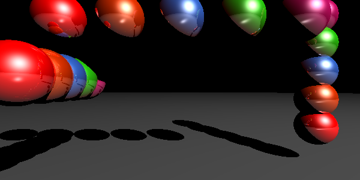

# pythonRayTracing
A rudimentary ray tracer made in Python

### Output

References: 
* https://medium.com/swlh/ray-tracing-from-scratch-in-python-41670e6a96f9
* https://en.wikipedia.org/wiki/Ray_tracing_(graphics)
